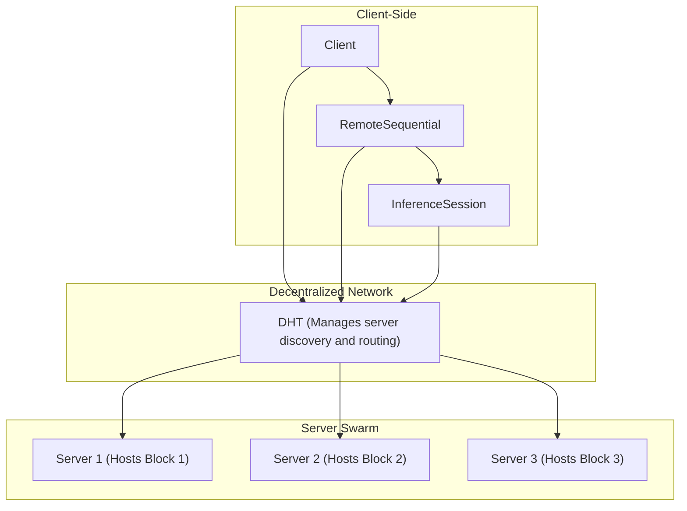

# Agent Grid
Agent Grid is a decentralized framework for running large-scale language models (LLMs) efficiently without requiring high-end GPUs. It allows you to pool compute resources from multiple commodity machines to run models that would otherwise be too large to fit into a single machine's memory. This is achieved by splitting the model into smaller, manageable blocks and distributing them across a swarm of participating servers.
## Key Features
* Decentralized Inference: Run massive language models on a network of devices, breaking the boundaries of single-machine limitations.
* Fault-Tolerant: The system is designed to be resilient to server failures. If a server in the sequence becomes unavailable, Agent Grid will automatically find an alternative path to complete the request.
* Efficient Scaling: The framework is designed for optimal performance, with features like tensor parallelism and quantization to maximize throughput and minimize latency.
* Speculative Generation: For certain models, Agent Grid supports speculative generation to accelerate inference.
* Easy to Use: A simple and intuitive Python API that abstracts away the complexity of the decentralized network.
* Extensible: Easily add support for new models and custom modules.
## Architecture
Agent Grid operates on a client-server model built on top of a decentralized hash table (DHT) powered by Hivemind. Here's a high-level overview of the architecture:

When a client wants to run a model, it interacts with a RemoteSequential module. This module, with the help of a RemoteSequenceManager, queries the DHT to find which servers are hosting the required model blocks. The RemoteSequenceManager then constructs a path through the swarm of servers.

For inference, an InferenceSession is created. This session maintains the attention caches on the respective servers, so you don't have to re-run the entire prefix for each new token generation. This makes interactive generation and chatbots much more efficient.

# Getting Started
## Installation
To get started with Agent Grid, clone the repository and install the dependencies:
```Bash
git clone https://github.com/reenvision-ai/agent-grid.git  
cd agent-grid  
pip install .
```
The project dependencies are listed in the `setup.cfg` file and include libraries like `torch`, `transformers`, `hivemind`, and `tensor_parallel`.
## Running a Server
You can start a server and join the public swarm using the provided shell scripts. The `start_server.sh` and `start_swarm.sh` scripts provide a convenient way to launch a server with the necessary configurations.
First, you'll need to create a `.env` file with your Hugging Face token:
`HF_TOKEN="your_hugging_face_token"`
You'll also need a `models` file with a list of models you want to serve. For example:
```Bash
MODELS=(  
"meta-llama/Llama-2-7b-hf"  
"Qwen/Qwen1.5-7B-Chat"  
)
```
Then, you can start the server:
```Bash
./start_server.sh
```
This will start a server that connects to the public swarm and serves the specified model.
## Using the Client
Here's a simple example of how to use the Agent Grid client to run a distributed model:
```Python
from agentgrid import AutoDistributedModelForCausalLM  
from transformers import AutoTokenizer
# Load the distributed model  
model = AutoDistributedModelForCausalLM.from_pretrained("meta-llama/Llama-2-7b-hf")
# Load the tokenizer  
tokenizer = AutoTokenizer.from_pretrained("meta-llama/Llama-2-7b-hf")
# Generate text  
inputs = tokenizer("The meaning of life is", return_tensors="pt")  
outputs = model.generate(**inputs)  
print(tokenizer.decode(outputs[0]))
```
### Supported Models
Agent Grid supports a variety of models, including:
* LLaMA
* Qwen2
* Nemotron
* And more...
You can easily add support for new models by creating a new module in the src/agentgrid/models directory.
